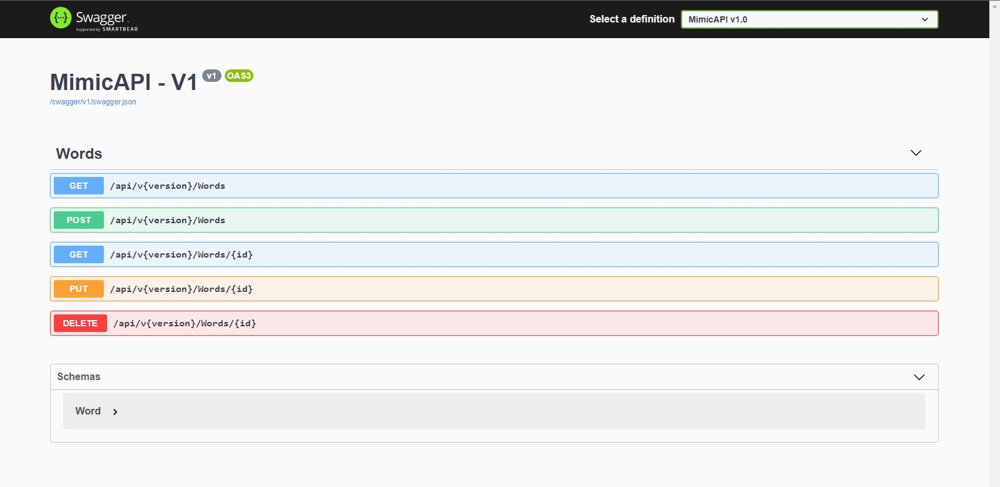
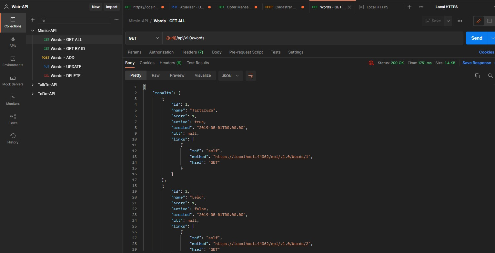
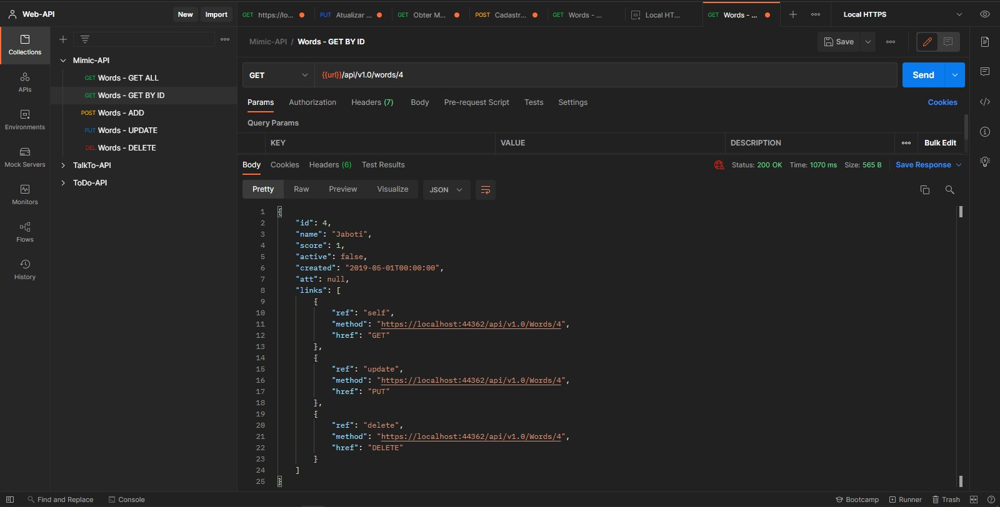
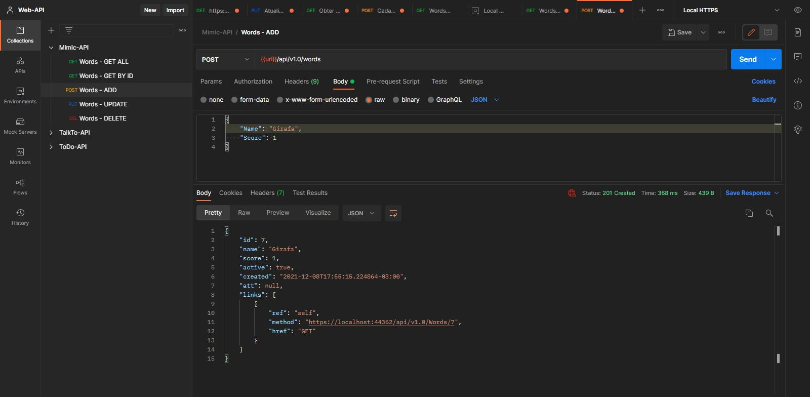
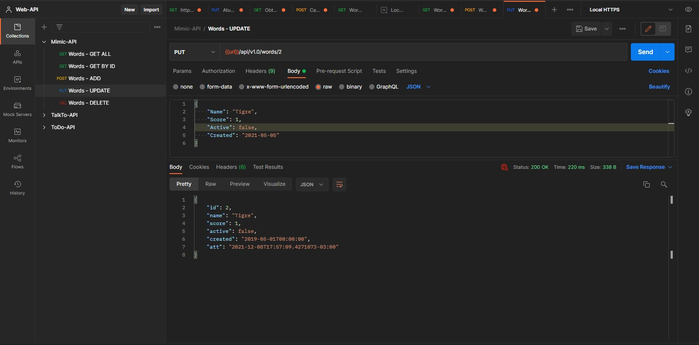
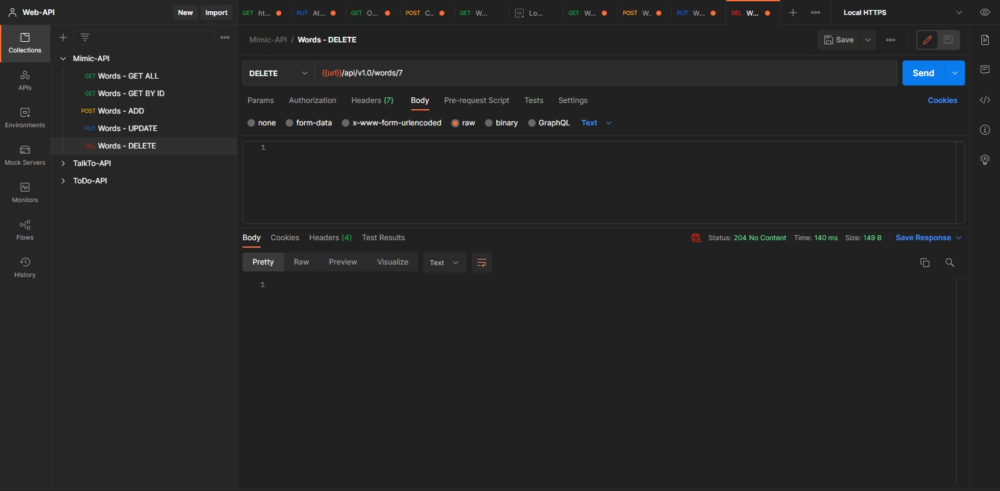

# MimicAPI - API REST created on Udemy REST API classes

<h3>A Restfull API serving web and mobile developed on .Net 5 using C#<h3>

<h3>Postman tests 🖥️</h3>
</img>
 
</img>
 
</img>
 
</img>
 
</img>
 
</img>

<h3>Overview ⮯</h3>

The REST API is based on a Mimic App, serving web/mobile, delivering, updating and posting words in the database and also, synchonizing the data, between the user local data and the server side database who can be updated when more words are added. It was added swagger for the api documentation, and versioning, pagination and hateoas to make more usefull for the final user, being in the third api maturity level.

 
<h2>This project has concepts like :<h2>
<ul>
  <li>Totally RESTFULL API ⬇</li>
  <li>API Pagination 🔧</li>
  <li>Hateoas delivering the return with links to other methods ⬇</li>
  <li>Use of Auto-Mapper for the models mapping 🔧</li>
</ul>
 
<h3>How to run ⮯</h3>

You just need to git clone the project do the migrations for the 
  database update and set the url to your on localhost gate, to set the environment ready to run, and the most important, HAVE FUNN !🧑

ATT: 30/11/2021 - 👨‍💻 João Vítor Carvalho

<em>'This project has no commercial purposes, it was carried out only for the application of my studies'📚</em>

<strong>----João Vítor Carvalho 👨‍💻 ---</strong>
